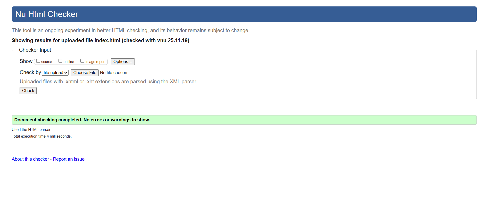
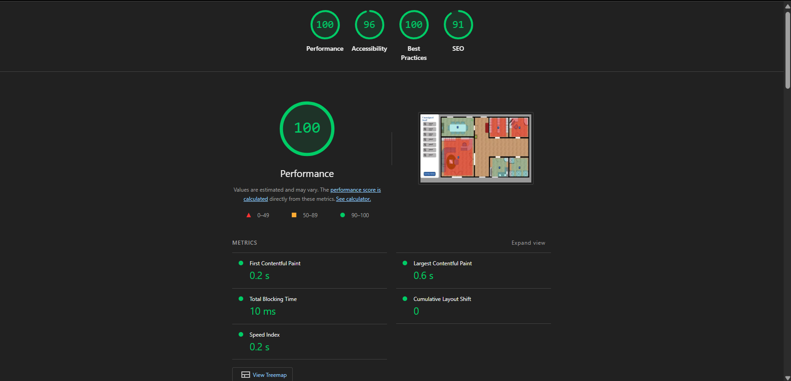
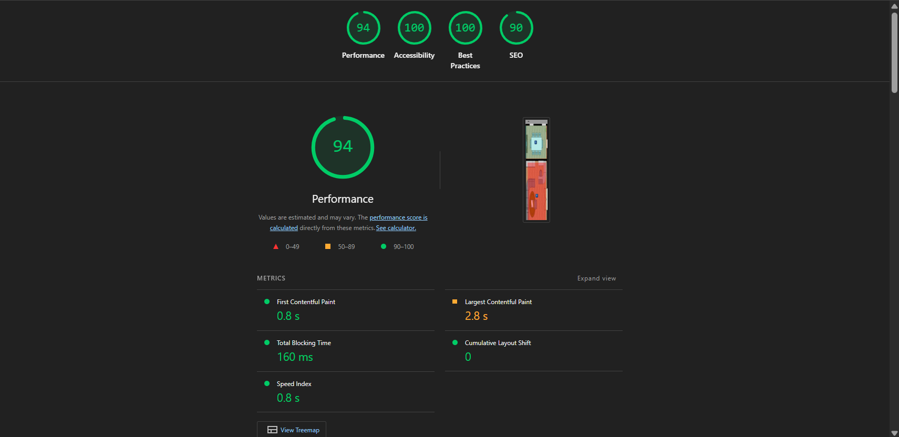

# Virtual Workspace (WorkSphere)

# Virtual Workspace (WorkSphere)

Petit projet front-end qui simule l'affectation du personnel dans les différentes salles d'un bureau à l'aide d'un plan visuel. Réalisé en HTML, CSS et JavaScript purs.

## Fonctionnalités
- Ajouter de nouveaux employés avec nom, rôle, URL de l'image, contact et expériences.
- Validation des champs (nom, email, téléphone, URL d'image, dates d'expérience).
- Affecter et désaffecter des employés aux salles (conférence, serveurs, réception, sécurité, salle du personnel, archives) avec restrictions selon le rôle.
- Afficher les détails d'un employé dans une fenêtre modale.

## Utilisation
1. Ouvrez `index.html` dans votre navigateur (ou servez le dossier avec un serveur statique / Live Server).
2. Utilisez la barre latérale pour voir le personnel non affecté et cliquez sur `Add New Worker` pour ouvrir le formulaire.
3. Cliquez sur le bouton `+` d'une salle pour affecter un employé à cette salle (des règles selon le rôle s'appliquent).
4. Cliquez sur l'image de profil ou la carte pour voir les détails, ou utilisez le bouton rouge `x` pour désaffecter un employé.

## Fichiers
- `index.html` — page principale et balisage.
- `style.css` — styles et mise en page responsive.
- `script.js` — logique de l'application (ajout, validation, affectation/désaffectation, modales).
- `img/` — images utilisées par l'interface (placez-y les captures d'écran ci-dessous).
- `README.md` — ce fichier.

## Développement
- Aucun outil de build nécessaire — projet front-end statique.
- Recommandation : ouvrir le dossier dans VS Code et utiliser l'extension "Live Server" pour rechargements automatiques.

## Remarques
- L'application utilise des tableaux en mémoire (`unassigned` et `assigned`) : les données ne sont pas persistées après rechargement de la page.

## Images / Rapports

## déploiement - github pages

-demo en ligne: https://abdelhafidaz.github.io/Virtual-Workspace/